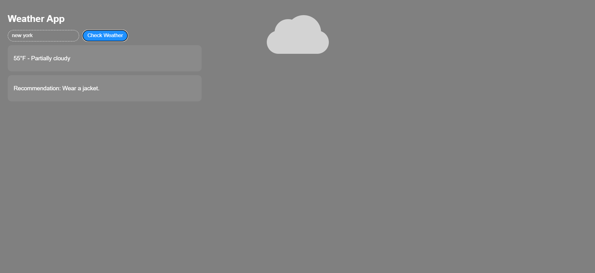

# Weather App

This project is a simple weather web app that allows users to enter a location and check the current weather. It also gives outfit recommendations based on the temperature and chance of rain.

## Features

- Search weather by location
- Display temperature and weather conditions
- Give outfit recommendations
- Change the background visuals depending on the weather
- Show sun, clouds, or rain effects

## Screenshot

## API Used

This project uses the **Visual Crossing Weather API** to get weather data.

This project was created for a class assignment using HTML, CSS, JavaScript, and Markdown.

## Technologies Used

- HTML
- CSS
- JavaScript
- Visual Crossing Weather API
- Markdown

## How It Works

1. The user enters a location.
2. The app sends a request to the weather API.
3. The weather data is displayed on the page.
4. The app suggests clothing based on the temperature.
5. The visuals update depending on the weather conditions.

